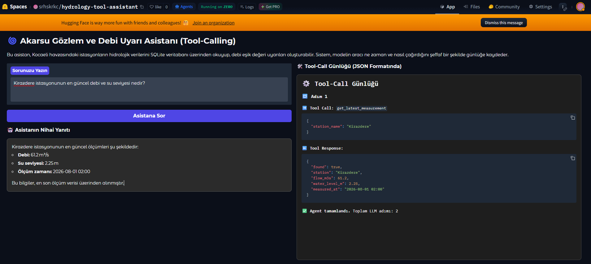
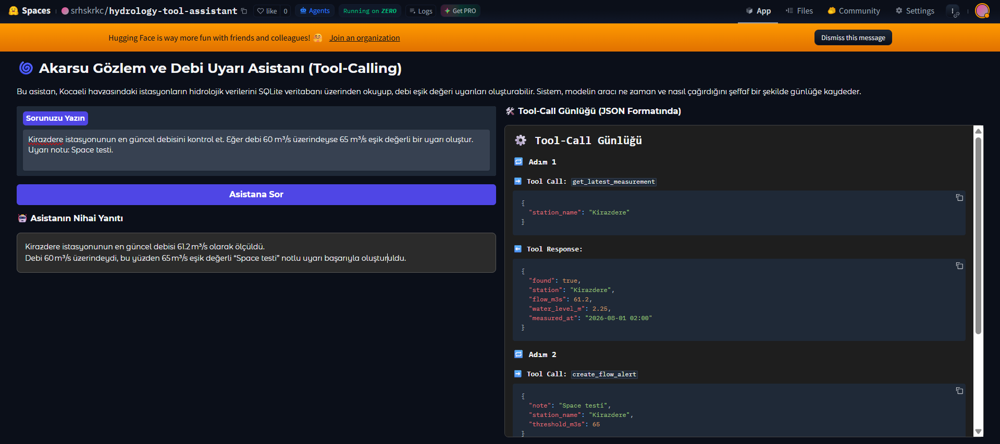
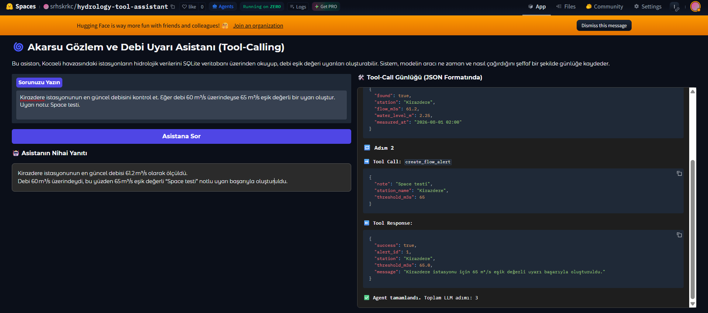

# 🌀 Akarsu Gözlem ve Debi Uyarı Asistanı

Bu proje, iki ödevi tek bir repo altında sunmaktadır:
> **Güncelleme Notu:** Proje, ilk teslimden sonra ders gerekliliklerine daha tam uyum sağlayacak şekilde güncellenmiştir. Chat Template kendi Odysseia tokenizer'ıma eklenmiş; Tool-Calling tarafında konuşma geçmişi ve oluşturulan uyarıları tekrar okumak için `list_flow_alerts` desteği eklenmiştir.

1. **Custom Chat Template (Jinja2)**
2. **Tool-Calling Assistant**

Projenin senaryosu, Kocaeli bölgesindeki sentetik akarsu gözlem istasyonları üzerinden hidrolojik ölçümlerin sorgulanması ve debi eşik uyarılarının oluşturulmasıdır.

---

## 1. Custom Chat Template (Jinja2)

Bu bölümde Hafta 1'de geliştirdiğim kendi ByteLevel BPE tokenizer'ım kullanılmıştır:

```text
srhskrkc/odysseia-bpe-tokenizer
```

Tokenizer reposu:

```text
https://huggingface.co/srhskrkc/odysseia-bpe-tokenizer
```

Hafta 3.2 kapsamında Hafta 1'de hazırladığım tokenizer'a özel sohbet rol tokenları ve Jinja tabanlı bir Chat Template eklenmiştir. BPE modeli yeniden eğitilmemiş, mevcut tokenizer yapısı korunmuştur.

Chat Template'in güncel ve asıl sürümü yukarıda bağlantısı verilen kendi tokenizer reposunda bulunmaktadır.

Eklenen sohbet rol tokenları:

- `<|system|>`
- `<|user|>`
- `<|assistant|>`

Mevcut `<|endoftext|>` tokenı BOS/EOS olarak korunmuştur.

Chat Template yalnızca metin tabanlı `system`, `user` ve `assistant` mesajlarını işler.

Tool-Calling Assistant ise ayrı bir çalışma olarak kendi model ve tool-calling yapısını kullanır. Bu nedenle Chat Template ile Tool Calling yapıları birbirine karıştırılmamıştır.

### Chat Template Testi

Chat Template'in çalıştığını kontrol etmek için proje içerisinde basit bir test dosyası da bulunmaktadır:

```bash
python test_chat_template.py
```

`test_chat_template.py`, `srhskrkc/odysseia-bpe-tokenizer` tokenizer'ını yükler. Projede bulunan yerel `chat_template.jinja` dosyası tokenizer'ın `chat_template` alanına atanır ve `apply_chat_template()` ile system, user, assistant, tool ve
tool-calling mesaj yapılarının doğru biçimde oluşturulduğu test edilir.

Örnek çıktı yapısı:

```text
<|endoftext|><|system|>
Sen yardımcı bir Türkçe asistansın.<|endoftext|>
<|user|>
Odysseus kimdir?<|endoftext|>
<|assistant|>
```

> Tool-Calling Assistant ayrı bir ödev bölümüdür. Uygulamada kullanılan
> `openai/gpt-oss-20b` modeli, Hugging Face Inference Providers tarafındaki kendi chat/tool
> formatını kullanır. Odysseia tokenizer'ındaki bu Jinja şablonu Ödev 1'i göstermek içindir.

---

## 2. Tool-Calling Assistant

Tool-Calling Assistant, doğal dilde ilerleyen **çok turlu bir hidroloji senaryosunu** yürütür. Konuşma geçmişini korur, gerekli araçları LLM seçer ve SQLite veritabanı üzerinde gerçek okuma/yazma işlemleri gerçekleştirir.

### Kullanılan Model

```text
openai/gpt-oss-20b
```

Model, Hugging Face Inference Providers üzerinden çağrılmaktadır.

Tool seçiminde:

```text
tool_choice="auto"
```

kullanılmaktadır.

---

## 🏗️ Mimari

Genel işlem akışı:

```text
Kullanıcı Mesajı + Konuşma Geçmişi
   ↓
Gradio Arayüzü + gr.State
   ↓
LLM Agent
   ↓
Tool Calling
   ↓
Python Tool Dispatcher
   ↓
SQLite Veritabanı
   ↓
Tool Response
   ↓
LLM
   ↓
Nihai Yanıt + Güncellenmiş Konuşma Geçmişi
```

Ana bileşenler:

```text
app.py
    ↓
agent.py
    ↓
tool_schemas.py
    ↓
tools.py
    ↓
database.py
    ↓
data/hydrology.db
```

### Dosyaların Görevleri

- `app.py`: Gradio kullanıcı arayüzünü oluşturur.
- `agent.py`: LLM ile iletişimi ve çok adımlı tool-calling döngüsünü yönetir.
- `tool_schemas.py`: Modele sunulan tool şemalarını içerir.
- `tools.py`: Modelden gelen tool çağrılarını ilgili Python fonksiyonlarına yönlendirir.
- `database.py`: SQLite okuma ve yazma işlemlerini gerçekleştirir.
- `init_database.py`: Veritabanı tablolarını ve örnek başlangıç verilerini oluşturur.
- `chat_template.jinja`: Custom Chat Template ödevinin güncel yerel Jinja2 şablonunu içerir.
- `test_chat_template.py`: Chat Template'i tokenizer üzerinde test eder.

---

## 🎛️ Araçlar

Projede beş küçük ve birbirini tamamlayan tool bulunmaktadır.

### `list_stations`

Aktif akarsu gözlem istasyonlarını listeler.

**Tür:** Okuma

Örnek istek:

```text
Kocaeli'deki aktif istasyonları listele.
```

---

### `get_latest_measurement`

Belirtilen istasyonun en güncel:

- Debi (`m³/s`)
- Su seviyesi (`m`)
- Ölçüm zamanı

bilgilerini SQLite veritabanından getirir.

**Tür:** Okuma

Örnek istek:

```text
Kirazdere istasyonunun en güncel debi ve su seviyesi nedir?
```

---

### `create_flow_alert`

Bir istasyon için yeni debi eşik uyarısı oluşturur.

Veritabanındaki `alerts` tablosuna gerçek kayıt ekler.

**Tür:** Yazma

Temel parametreler:

- `station_name`
- `threshold_m3s`
- `note`

---
---

### `create_flow_alerts`

Birden fazla istasyon veya tüm aktif istasyonlar için aynı anda debi eşik uyarıları oluşturur.

Veritabanındaki `alerts` tablosuna seçilen her istasyon için ayrı bir kayıt ekler.

**Tür:** Yazma

Temel parametreler:

- `threshold_m3s`
- `station_names`
- `all_active`
- `note`

Örnek istek:

```text
Tüm aktif istasyonlar için 70 m³/s eşik değerli bir uyarı oluştur.
```

### `list_flow_alerts`

Daha önce oluşturulmuş debi uyarılarını SQLite veritabanından tekrar okur. İstenirse belirli bir istasyona göre filtreler.

**Tür:** Okuma

Örnek istek:

```text
Kirazdere için oluşturduğum uyarıları göster.
```

Bu araç sayesinde bir önceki turda veritabanına yazılan uyarının sonraki turda gerçekten okunabildiği gösterilir.

---

## 🗄️ SQLite Veritabanı

Proje gerçek bir SQLite veritabanı kullanmaktadır:

```text
data/hydrology.db
```

Temel tablolar:

- `stations`
- `measurements`
- `alerts`

Örnek istasyonlar:

- Kirazdere
- Kullar
- Yuvacık

Kirazdere için örnek ölçüm:

```text
Debi: 61.2 m³/s
Su seviyesi: 2.25 m
```

> Projedeki hidrolojik veriler eğitim ve demonstrasyon amacıyla oluşturulmuş sentetik verilerdir.

---

## 🔮 Hallüsinasyon Önleme

Agent'ın veritabanında bulunmayan hidrolojik değerleri üretmemesi için sistem promptunda kısıtlamalar bulunmaktadır.

Modelden:

- Veritabanından veya tool sonucundan gelmeyen hidrolojik değerleri uydurmaması
- Tool başarısız olduğunda bunu kullanıcıya açıkça belirtmesi
- Veritabanında bulunmayan bir istasyon için ölçüm üretmemesi
- Bir uyarının başarıyla oluşturulduğunu yalnızca `create_flow_alert` veya `create_flow_alerts` aracı başarı döndürürse söylemesi

istenmektedir.

Örneğin kullanıcı:

```text
Atlantis istasyonunun en güncel debi ve su seviyesi nedir?
```

diye sorduğunda sistem `get_latest_measurement` aracını çağırır.

Tool sonucu:

```json
{
  "found": false,
  "message": "'Atlantis' adlı aktif istasyon için ölçüm kaydı bulunamadı."
}
```

şeklinde döndüğünde model herhangi bir debi veya su seviyesi uydurmaz.

Örnek nihai cevap:

```text
“Atlantis” adlı istasyon için ölçüm kaydı bulunamadı.
Bu nedenle en güncel debi ve su seviyesi bilgisi verilememektedir.
```

---

## 🔁 Çok Turlu Senaryo ve Tool Calling Örneği

Ödevdeki "küçük bir hikâye" yaklaşımı için uygulama tek bir uzun komut yerine birkaç doğal konuşma turuyla kullanılabilir:

### Tur 1 — Sistemi keşfetme

**Kullanıcı:**

```text
Kocaeli'deki aktif akarsu gözlem istasyonları hangileri?
```

Agent `list_stations` aracını çağırır ve SQLite'taki gerçek istasyon listesini kullanıcıya verir.

### Tur 2 — Bir istasyonu inceleme

**Kullanıcı:**

```text
Kirazdere'nin son ölçümüne bakalım.
```

Agent konuşma bağlamını korur ve `get_latest_measurement("Kirazdere")` aracını çağırır. Örnek veritabanında son debi `61.2 m³/s`, su seviyesi `2.25 m` olarak döner.

### Tur 3 — Gerçek yazma işlemi

**Kullanıcı:**

```text
Onun için 65 m³/s eşikli bir uyarı oluştur.
```

"Onun" ifadesi önceki turdaki Kirazdere bağlamından çözülür. Agent `create_flow_alert` aracını çağırır ve `alerts` tablosuna gerçek kayıt eklenir.

### Tur 4 — Yazılan veriyi tekrar okuma

**Kullanıcı:**

```text
Kirazdere için oluşturduğum uyarıları göster.
```

Agent `list_flow_alerts` aracını çağırır. Böylece önceki turda oluşturulan uyarının veritabanında gerçekten bulunduğu ve durumunun `ACTIVE` olduğu tekrar okunur.

Bu senaryoda kullanıcı → LLM → tool → SQLite → tool response → LLM döngüsü birden fazla konuşma turu boyunca devam eder. Uygulamadaki `gr.State`, konuşma geçmişini sonraki kullanıcı mesajına taşır.

---

## 💻 Yerel Kurulum

### 1. Projeyi indirin

```bash
git clone https://github.com/skrkc/hydrology-tool-assistant
cd hydrology-tool-assistant
```

### 2. Gerekli paketleri kurun

```bash
python -m pip install -r requirements.txt
```

### 3. Hugging Face hesabına giriş yapın

Hugging Face Inference erişimine sahip bir Access Token gereklidir.

```bash
hf auth login
```

Token değeri kaynak koduna yazılmamalı ve GitHub deposuna yüklenmemelidir.

### 4. Veritabanını hazırlayın

```bash
python init_database.py
```

Bu komut gerekli tabloları ve örnek başlangıç verilerini oluşturur.

### 5. Uygulamayı çalıştırın

```bash
python app.py
```

Ardından tarayıcıdan:

```text
http://127.0.0.1:7860
```

adresine erişilebilir.

---

## 📦 Gereksinimler

Test edilen temel paket sürümleri:

```text
gradio==5.49.1
huggingface_hub==1.23.0
transformers==5.14.1
spaces==0.51.1
```

Gerekli paketler `requirements.txt` dosyasında bulunmaktadır.

---

## 🧪 Testler

### Test 1 — Custom Chat Template

```bash
python test_chat_template.py
```

> Bu test `srhskrkc/odysseia-bpe-tokenizer` tokenizer'ı üzerinde projedeki yerel `chat_template.jinja` dosyasını kullanır.

### Test 2 — Veritabanından Ölçüm Okuma

```text
Kirazdere'nin son ölçümüne bakalım.
```

Beklenen tool: `get_latest_measurement`

### Test 3 — Çok Turlu Bağlam

İlk turda Kirazdere konuşulduktan sonra:

```text
Onun için 65 m³/s eşikli bir uyarı oluştur.
```

ifadesindeki "onun" önceki konuşma bağlamından Kirazdere olarak yorumlanabilmelidir.

### Test 4 — Gerçek Yazma ve Sonraki Turda Okuma

Önce `create_flow_alert` ile uyarı oluşturulur. Sonraki kullanıcı mesajında:

```text
Kirazdere için oluşturduğum uyarıları göster.
```

`list_flow_alerts` çağrılır ve aynı kayıt SQLite'tan geri okunur.

### Test 5 — Hallüsinasyon Kontrolü

```text
Atlantis istasyonunun en güncel debi ve su seviyesi nedir?
```

Veritabanında böyle bir istasyon bulunmadığından agent herhangi bir hidrolojik değer üretmemelidir.

---

## 🌐 Hugging Face Space

Hugging Face Space bağlantısı:

```text
https://huggingface.co/spaces/srhskrkc/hydrology-tool-assistant
```


---

## 📸 Tool-Call Örneği

Gradio arayüzünde tool çağrıları ve tool sonuçları JSON formatında görüntülenmektedir.

Örnek konuşma akışı:

```text
get_latest_measurement
        ↓
SQLite'tan ölçüm okuma
        ↓
create_flow_alert
        ↓
SQLite'a uyarı yazma
        ↓
list_flow_alerts
        ↓
Yazılan uyarıyı SQLite'tan tekrar okuma
```

### Ölçüm Okuma

Kirazdere istasyonunun son ölçümü `get_latest_measurement` aracı ile SQLite veritabanından okunmaktadır.



### Konuşma Bağlamı ile Uyarı Oluşturma

Önceki mesajda konuşulan Kirazdere istasyonu, kullanıcının "Onun için" ifadesinden konuşma geçmişi kullanılarak anlaşılır ve `create_flow_alert` aracı çağrılır.



### Oluşturulan Uyarıyı Tekrar Okuma

Bir önceki turda SQLite veritabanına yazılan uyarı, `list_flow_alerts` aracı ile tekrar okunmaktadır.



---

## 🕸️ Proje Yapısı

```text
hydrology-tool-assistant/
│
├── app.py
├── agent.py
├── database.py
├── init_database.py
├── tools.py
├── tool_schemas.py
│
├── chat_template.jinja
├── test_chat_template.py
├── requirements.txt
├── README.md
│
└── data/
    └── hydrology.db
```

---

## 🔖 Özet

Bu projede:

- Hafta 1'de geliştirdiğim Odysseia BPE tokenizer'a Hafta 3.2 kapsamında özel bir Jinja Chat Template eklenmiştir.
- Chat Template `system`, `user` ve `assistant` rollerini işler; güncel sürümü doğrudan kendi Odysseia tokenizer reposunda bulunmaktadır.
- Chat Template, Hugging Face üzerinden kendi tokenizer reposu tekrar yüklenerek `apply_chat_template()` ile test edilmiştir.
- Gerçek structured tool calling kullanılmaktadır.
- SQLite üzerinden veri okunmaktadır.
- SQLite'a veri yazılmaktadır.
- Oluşturulan debi uyarıları `list_flow_alerts` aracı ile veritabanından tekrar sorgulanabilmektedir.
- Birden fazla tool ardışık olarak çağrılabilmektedir.
- Konuşma geçmişi turlar arasında korunmaktadır.
- SQLite'a yazılan uyarı sonraki turda tekrar okunabilmektedir.
- Tool sonuçları tekrar LLM'e gönderilmektedir.
- Veritabanında bulunmayan hidrolojik bilgilerin uydurulması engellenmektedir.
- Gradio tabanlı kullanıcı arayüzü bulunmaktadır.
- Tool-call adımları kullanıcı arayüzünde görüntülenebilmektedir.
